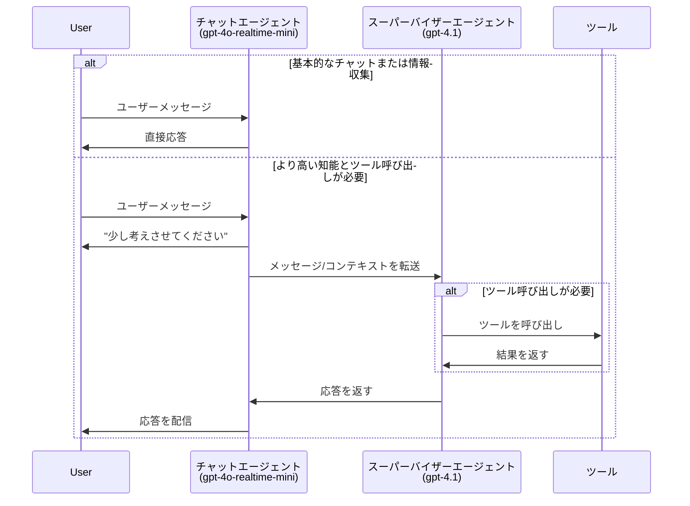
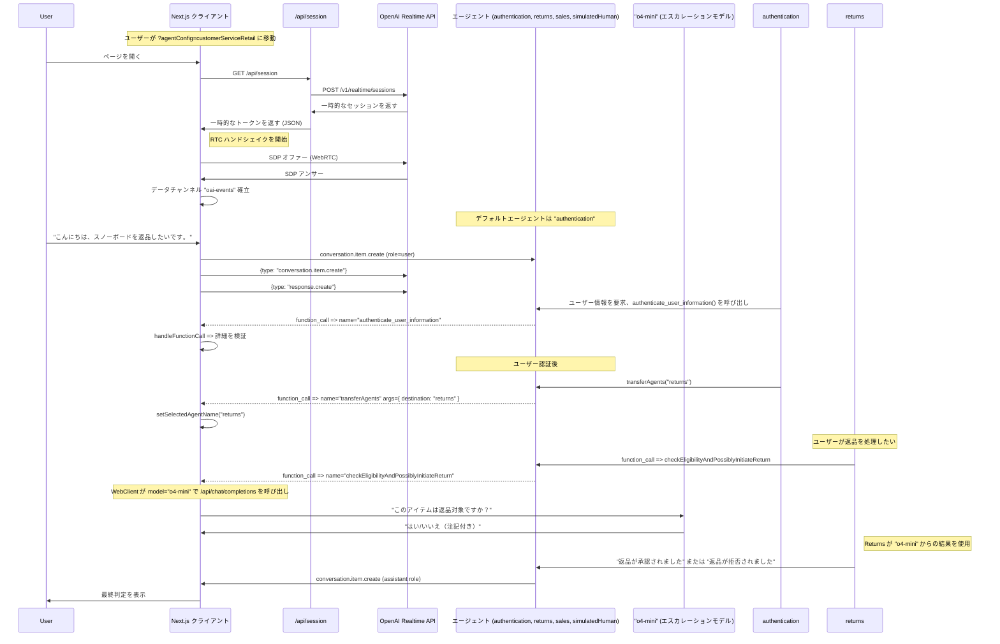

# Realtime API エージェントデモ

これは、OpenAI Realtime API と OpenAI Agents SDK を使用したボイスエージェントのより高度なパターンのデモンストレーションです。

## OpenAI Agents SDK について

このプロジェクトは [OpenAI Agents SDK](https://github.com/openai/openai-agents-js) を使用しています。これは高度な AI エージェントの構築、管理、デプロイのためのツールキットです。SDK は以下を提供します：

- エージェントの動作とツール統合を定義するための統一インターフェース
- エージェントオーケストレーション、状態管理、イベント処理の組み込みサポート
- 低遅延ストリーミングインタラクションのための OpenAI Realtime API との簡単な統合
- マルチエージェント協調、ハンドオフ、ツール使用、ガードレールの拡張可能なパターン

完全なドキュメント、ガイド、API リファレンスについては、公式の [OpenAI Agents SDK ドキュメント](https://github.com/openai/openai-agents-js#readme) を参照してください。

**注意：** OpenAI Agents SDK を使用しないバージョンについては、[without-agents-sdk ブランチ](https://github.com/openai/openai-realtime-agents/tree/without-agents-sdk) を参照してください。

実演される主要なパターンは2つです：
1. **チャット・スーパーバイザー：** リアルタイムベースのチャットエージェントがユーザーと対話し基本的なタスクを処理し、より知的なテキストベースのスーパーバイザーモデル（例：`gpt-4.1`）がツール呼び出しとより複雑な応答に広く使用されます。このアプローチは簡単な導入と高品質な回答を提供し、遅延がわずかに増加します。
2. **シーケンシャルハンドオフ：** 特化したエージェント（リアルタイム API を搭載）がユーザーを特定のユーザー意図を処理するために相互に転送します。これは、特定のドメインで優れた専門モデルによってユーザーの意図を順次処理できるカスタマーサービスに適しています。これにより、単一のエージェントにすべての指示とツールを持たせることを避け、パフォーマンスの低下を防ぎます。

## セットアップ

- これは Next.js TypeScript アプリです。`npm i` で依存関係をインストールしてください。
- `OPENAI_API_KEY` を環境変数に追加してください。`.bash_profile` などに追加するか、`.env.sample` を `.env` にコピーして追加してください。
- `npm run dev` でサーバーを起動してください。
- ブラウザで [http://localhost:3000](http://localhost:3000) を開いてください。デフォルトで `chatSupervisor` エージェント設定になります。
- 右上の「シナリオ」ドロップダウンで例を変更できます。

# エージェントパターン 1：チャット・スーパーバイザー

これは [chatSupervisor](src/app/agentConfigs/chatSupervisor/index.ts) エージェント設定でデモンストレーションされています。チャットエージェントはリアルタイムモデルを使用してユーザーと会話し、挨拶、カジュアルな会話、情報収集などの基本的なタスクを処理し、より知的なテキストベースのスーパーバイザーモデル（例：`gpt-4.1`）がツール呼び出しとより困難な応答を処理するために広く使用されます。必要に応じて特定のタスクをチャットエージェントに「オプトイン」することで決定境界を制御できます。

ビデオウォークスルー：[https://x.com/noahmacca/status/1927014156152058075](https://x.com/noahmacca/status/1927014156152058075)

## 例

*この交流では、電話番号を収集するための即座の応答と、ツール呼び出しを処理し応答を策定するためのスーパーバイザーエージェントへの延期に注目してください。「少しお待ちください。」の発話終了から「お待たせいたしました。前回の請求書は...」の開始まで約2秒あります。*

## 概略図


## メリット
- **簡単な導入。** すでに高性能なテキストベースチャットエージェントがある場合、同じプロンプトとツールセットをスーパーバイザーエージェントに与え、チャットエージェントプロンプトにいくつかの調整を加えることで、テキストエージェントと同等のパフォーマンスを持つ自然な音声エージェントを作成できます。
- **完全なリアルタイムエージェントへの簡単な移行**：エージェント全体をリアルタイム API に切り替える代わりに、一度に一つのタスクを移動し、プロダクションにデプロイする前に各タスクを検証し信頼を構築する時間を取ることができます。
- **高い知能**：`gpt-4.1` などのモデルの高い知能、優れたツール呼び出し、指示遵守を音声エージェントで活用できます。
- **低コスト**：チャットエージェントが基本的なタスクにのみ使用される場合、GPT-4.1 と組み合わせても完全な 4o-realtime モデルを使用するよりも安価になるはずの realtime-mini モデルを使用できます。
- **ユーザーエクスペリエンス**：ユーザーが話し終わった後の応答遅延が 1.5 秒以上になることが多い結合モデルアーキテクチャよりも、より自然な会話体験です。このアーキテクチャでは、スーパーバイザーエージェントに依存する必要がある場合でも、モデルがすぐにユーザーに応答します。
  - ただし、完全な応答ですぐに応答するのではなく、「少し考えさせてください」で始まるアシスタント応答が増えます。

## あなた自身のエージェント用に変更する
1. [supervisorAgent](src/app/agentConfigs/chatSupervisorDemo/supervisorAgent.ts) を更新してください。
  - 既存のテキストエージェントプロンプトとツールがある場合は追加してください。これは音声エージェントロジックの「核心」を含み、何をすべき/すべきでないか、どう応答すべきかについて非常に具体的であるべきです。`==== ドメイン固有エージェント指示 ====` の下にこの情報を追加してください。
  - このプロンプトを音声により適切にアップデートすべきでしょう。例えば、簡潔で長いアイテムリストを避ける指示などです。
2. [chatAgent](src/app/agentConfigs/chatSupervisor/index.ts) を更新してください。
  - チャットエージェントの指示をあなた自身のトーン、挨拶などでカスタマイズしてください。
  - `chatAgentInstructions` にツール定義を追加してください。モデルが混乱してツールを直接呼び出そうとしないよう、JSON ではなく簡潔な YAML 記述をお勧めします。
  - `# 許可されたアクションの許可リスト` セクションに新しいアイテムを追加することで決定境界を変更できます。
3. コストを削減するために、チャットエージェントに `gpt-4o-mini-realtime` を、スーパーバイザーモデルに `gpt-4.1-mini` を使用することを試してください。特に困難または重要なタスクで知能を最大化するため、遅延をトレードオフしスーパーバイザープロンプトに思考の連鎖を追加するか、`o4-mini` を使用する追加の推論モデルベースのスーパーバイザーを使用することを検討してください。

# エージェントパターン 2：シーケンシャルハンドオフ

このパターンは [OpenAI Swarm](https://github.com/openai/swarm) にインスパイアされ、特化したエージェント間でのユーザーのシーケンシャルハンドオフを含みます。ハンドオフはモデルによって決定され、ツール呼び出しを介して調整され、可能なハンドオフはエージェントグラフで明示的に定義されます。ハンドオフは新しい指示とツールで session.update イベントをトリガーします。このパターンは、それぞれが長い指示と多数のツールを持つ可能性のある専門エージェントで、さまざまなユーザー意図を処理するのに効果的です。

動作を示す[ビデオウォークスルー](https://x.com/OpenAIDevs/status/1880306081517432936)があります。このリポジトリを使用して、20分未満で独自のマルチエージェントリアルタイム音声アプリをプロトタイプできるはずです！


*この簡単な例では、ユーザーが挨拶エージェントから俳句エージェントに転送されます。このフローの簡単で完全な設定は以下を参照してください。*

`src/app/agentConfigs/simpleExample.ts` の設定
```typescript
import { RealtimeAgent } from '@openai/agents/realtime';

// OpenAI Agents SDK を使用してエージェントを定義
export const haikuWriterAgent = new RealtimeAgent({
  name: 'haikuWriter',
  handoffDescription: '俳句を書くエージェント。', // agent_transfer ツールのコンテキスト
  instructions:
    'ユーザーにトピックを尋ね、そのトピックについての俳句で返答してください。',
  tools: [],
  handoffs: [],
});

export const greeterAgent = new RealtimeAgent({
  name: 'greeter',
  handoffDescription: 'ユーザーに挨拶するエージェント。',
  instructions:
    "ユーザーに挨拶し、俳句が欲しいかどうか尋ねてください。はいの場合、'haikuWriter' エージェントにハンドオフしてください。",
  tools: [],
  handoffs: [haikuWriterAgent], // このエージェントがハンドオフできるエージェントを定義
});

// エージェントセットは、シナリオに参加するエージェントの配列です
export default [greeterAgent, haikuWriterAgent];
```
## CustomerServiceRetail フロー

これは以下の機能を示すより複雑で代表的な実装です：
- ユーザー認証、返品、販売、エスカレーション用の仮想人間エージェントのためのエージェントを持つより複雑なエージェントグラフ
- 上記と同様のパターンを使用した、重要な決定の例として返品を検証し開始するための [returns](https://github.com/openai/openai-realtime-agents/blob/60f4effc50a539b19b2f1fa4c38846086b58c295/src/app/agentConfigs/customerServiceRetail/returns.ts#L233) エージェントから `o4-mini` へのエスカレーション
- ユーザーを認証するために名前や電話番号などを文字単位の確認で正確に収集するなど、状態機械に従うモデルのプロンプト
  - このフローをテストするには、スノーボードを返品したいと言って必要なプロンプトを実行してください！

[src/app/agentConfigs/customerServiceRetail/index.ts](src/app/agentConfigs/customerServiceRetail/index.ts) の設定。
```javascript
import authentication from "./authentication";
import returns from "./returns";
import sales from "./sales";
import simulatedHuman from "./simulatedHuman";
import { injectTransferTools } from "../utils";

authentication.downstreamAgents = [returns, sales, simulatedHuman];
returns.downstreamAgents = [authentication, sales, simulatedHuman];
sales.downstreamAgents = [authentication, returns, simulatedHuman];
simulatedHuman.downstreamAgents = [authentication, returns, sales];

const agents = injectTransferTools([
  authentication,
  returns,
  sales,
  simulatedHuman,
]);

export default agents;
```

## 概略図

この図は、詳細なイベントを含む `src/app/agentConfigs/customerServiceRetail/` で定義されたより高度なインタラクションフローを示しています。

<details>
<summary><strong>CustomerServiceRetail フロー図を表示</strong></summary>



</details>

# その他の情報
## 次のステップ
- これらのテンプレートをコピーして独自のマルチエージェント音声アプリを作成できます！新しいエージェントセット設定を作成したら、`src/app/agentConfigs/index.ts` に追加すると、UI の「シナリオ」ドロップダウンメニューで選択できるようになります。
- 各 agentConfig は instructions、tools、toolLogic を定義できます。デフォルトでは、toolLogic を定義しない限り、すべてのツール呼び出しは単純に `True` を返します。toolLogic は特定のツールロジックを実行し、会話にオブジェクト（例：検索された RAG コンテキスト）を返します。
- 状態機械の定義を含む customerServiceRetail で示されている規則を使用して独自のプロンプトを作成するためのヘルプが必要な場合、メタプロンプトを[こちら](src/app/agentConfigs/voiceAgentMetaprompt.txt)に含めているか、[Voice Agent Metaprompter GPT](https://chatgpt.com/g/g-678865c9fb5c81918fa28699735dd08e-voice-agent-metaprompt-gpt) を使用できます。

## 出力ガードレール
アシスタントメッセージは UI に表示される前に安全性とコンプライアンスがチェックされます。ガードレール呼び出しは現在 `src/app/App.tsx` の内部で直接実行されます：`response.text.delta` ストリームが開始するとメッセージを **IN_PROGRESS** としてマークし、サーバーが `guardrail_tripped` または `response.done` を発行するとメッセージをそれぞれ **FAIL** または **PASS** としてマークします。モデレーションのトリガー方法や表示方法を変更したい場合は、`App.tsx` 内で `guardrail_tripped` を検索してそこのロジックを調整してください。

## UI のナビゲーション
- シナリオドロップダウンでエージェントシナリオを選択でき、エージェントドロップダウンで特定のエージェントに自動的に切り替えることができます。
- 会話の記録は左側にあり、ツール呼び出し、ツール呼び出し応答、エージェント変更が含まれます。クリックして非メッセージ要素を展開してください。
- イベントログは右側にあり、クライアントとサーバーの両方のイベントを表示します。クリックして完全なペイロードを確認してください。
- 下部では、切断、自動音声活動検出または PTT の切り替え、オーディオ再生のオフ、ログの切り替えができます。

## プルリクエスト

問題やプルリクエストを遠慮なく開いてください。可能な限りレビューします。このリポジトリの精神は新しいエージェントフローのコアロジックをデモンストレーションすることです；このコア範囲を超える PR はマージされない可能性があります。

# コア貢献者
- Noah MacCallum - [noahmacca](https://x.com/noahmacca)
- Ilan Bigio - [ibigio](https://github.com/ibigio)
- Brian Fioca - [bfioca](https://github.com/bfioca)